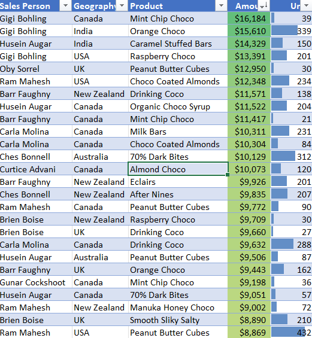
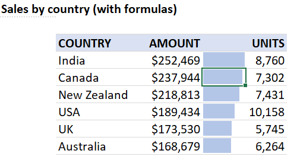
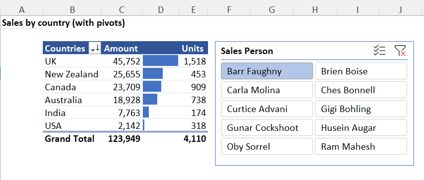

# Optimizing-Sales-Performance-and-Strategic-Decision-Making

  

*Project Descriptions*  
=====================
This sales report project aims to provide insights and answers to key business questions through data analysis. The project explores a dataset of sales information to uncover trends, patterns, and anomalies, and to inform business decisions. [Link to the dataset](https://www.kaggle.com/datasets/afolabiraymond/sales-data)

### Objectives

* Explore some functions
* Perform exploratory data analysis (EDA) to understand the data using conditional formatting
* Analyze sales by country using formulas and pivot tables
* Identify 5 top-selling products by unit price
* Detect anomalies in the data using Boxplot and Scatterplot graph
* Determine the best salesperson by country
* Calculate profits by product
* Generate dynamic country-level sales reports
* Recommend products for discontinuation

### Methodology

* Data analysis and visualization using __Microsoft Office Excel 365 with integration of Power Query Capabilities for data modelling__
* Formulas and pivot tables for data manipulation and aggregation
* Data mining techniques for anomaly detection
* Data visualization for effective communication of insights

### Expected Outcomes

* A comprehensive understanding of sales trends and patterns
* Data-driven insights to inform business decisions
* Identification of areas for improvement and opportunities for growth
* Recommendations for product discontinuation and sales strategy optimization

### Skills Demonstrated
* Data Analysis: Collecting, organizing, and analyzing data to extract insights and meaning.
* Data Visualization: Presenting data in a clear and concise manner using visualizations.
* Exploratory Data Analysis (EDA): Using statistical and visual methods to understand the data.
* Data Manipulation: Using formulas and pivot tables to manipulate and aggregate data.
* Anomaly Detection: Identifying unusual patterns or outliers in the data.
* Data Mining: Discovering patterns and relationships in large datasets.
* Reporting: Creating dynamic reports to communicate insights and findings.
* Business Acumen: Understanding business needs and translating data insights into actionable recommendations.
* Problem-Solving: Identifying areas for improvement and opportunities for growth.
* Communication: Effectively presenting complex data insights to stakeholders.
* Technical Skills: Proficiency in tools and software used for data analysis and visualization with Excel 365.
* Formulas (Functions): XLOOKUP, SUM, SUMIFS, AVERAGE, AVERAGEIFS, COUNT, COUNTIFS, COUNTBLANK, QUARTILES, RANGE, MIN, MAX, RANGE, UNIQUE, SORTBY, and IF inclusing formula nesting.
* Critical Thinking: Interpreting data, identifying patterns, and making informed decisions.

 
 ### **SOLUTIONS**  
 
__Exploring some functions__
==============================

=AVERAGE(data[Amount])  
=AVERAGE(data[Units])  
=MEDIAN(data[Amount])  
=MEDIAN(data[Units])  
=MIN(data[Amount])  
=MAX(data[Units])  
=MAX(data[Amount])  
=MAX(data[Units])  
=PERCENTILE.EXC(data[Amount], 0.25)  
=PERCENTILE.EXC(data[Units], 0.25)  
=PERCENTILE.EXC(data[Amount], 0.75)  
=PERCENTILE.EXC(data[Units], 0.75)  
=COUNTA(UNIQUE(data[Product]))  

## Sales Data Statistical Summary

| **Stats Measures**    | **Amount** | **Unit Sales** |
|-----------------------|------------|----------------|
| Average               | 4,136.23   | 152.2          |
| Median                | 3,437      | 124.5          |
| Min                   | 0          | 0              |
| Max                   | 16,184     | 525            |
| Range                 | 16,184     | 525            |
| 1st Quartile (Q1)     | 1,652      | 54             |
| 3rd Quartile (Q3)     | 6,245.75   | 223.5          |
| **Count of Unique Products** | 22 |                |

---

### **Interpretation of the Sales Data Structure using some functions:**

#### 1. **Average (Mean):**
   - **Sales**: 4,136.23
   - **Unit Sales**: 152.2  
   The average sales amount is 4,136.23, while the average number of units sold per transaction is 152.2. This gives us an idea of the typical sales value.
   However, it can be influenced by extremely high or low values (outliers). For example, if you have one or two very high sales figures, they can raise the average, making it seem like 
   sales are generally higher than they actually are.

#### 2. **Median:**
   - **Sales**: 3,437
   - **Unit Sales**: 124.5  
   The median sales amount of 3,437 suggests that half of the sales are below this number, and the other half are above. For units sold, the median is 124.5.
   The median is the middle value in a dataset when the values are arranged in ascending or descending order. If the number of values is even, the median is the average of the two middle 
   numbers. Also. the median represents the point at which half of your sales data is below and half is above. Unlike the average, the median is not affected by outliers, so it can 
   provide a more accurate picture of what a "typical" sales figure looks like.
  

#### 3. **Min (Minimum):**
   - **Sales**: 0
   - **Unit Sales**: 0  
   This suggests that there are some transactions where no sales or units were recorded, possibly indicating returns or data errors. In this case, it is one of our product **Manuka Honey Choco**. This could be as a result of sales promotion where the product was offered to customers for free.

#### 4. **Max (Maximum):**
   - **Sales**: 16,184
   - **Unit Sales**: 525  
   These values represent the highest sales and units sold in a single transaction.

#### 5. **Range:**
   - **Sales**: 16,184
   - **Unit Sales**: 525  
   The large range indicates high variability in both sales amount and unit sales, suggesting significant differences between transactions.

#### 6. **1st Quartile (Q1):**
   - **Sales**: 1,652
   - **Unit Sales**: 54  
   This shows that 25% of the transactions are below 1,652 in sales and 54 in units sold.

#### 7. **3rd Quartile (Q3):**
   - **Sales**: 6,245.75
   - **Unit Sales**: 223.5  
   This indicates that 75% of the transactions are below 6,245.75 in sales and 223.5 in units sold.

#### 8. **Count Unique of Products:**
   - **Unique Products**: 22  
   This indicates that there are 22 different products represented in the dataset.

---

### **Overall Insights:**
- **Variability:** There is significant variability in both sales and unit sales, as reflected by the large range and quartile gaps.
- **Skewness:** The data shows a right-skewed distribution with some high-value sales pulling up the average.
- **Quartile Insights:** Most transactions (75%) have sales below 6,245.75, with fewer high-value sales influencing the upper end of the distribution.
- **Product Variety:** A total of 22 unique products shows a moderate diversity in the products sold.
  
__Exploratory Data Analysis (EDA) with Conditional Formatting__
===============================================================================================
Conditional formatting in spreadsheet software like Microsoft Excel or Google Sheets is a feature that allows you to automatically apply formatting—such as colors, icons, or data bars—to cells based on the data they contain. This visual differentiation helps users quickly identify patterns, trends, and exceptions in their data.You can apply multiple conditional formatting rules to the same set of cells. The rules are evaluated in the order they are set, and you can control whether subsequent rules should be applied if a previous rule is met.

  
Based on the screenshot above, we applied conditional formatting applied to the amount and units column.. Conditional formatting is a feature in spreadsheet software that changes the formatting of cells based on the data they contain. Here’s an analysis of the possible logic behind the conditional formatting in your image:

### Color Coding by Amount:
- **Green**: may indicate higher sales amounts, perhaps marking the top 10% or top quartile of sales figures.
- **Lighter Green** or other colors: could indicate middle-tier sales amounts, possibly representing the median range of sales figures.
- There may be other colors not as easily discernible from the image that categorize lower sales amounts or other specific criteria.

### Highlighting Specific Products:
- Some products like **"Mint Chip Choco"** and **"70% Dark Bites"** are highlighted, which could signify special focus areas—perhaps these are new product launches, seasonal offerings, or strategically important products for the business.

### Geographic Indicators:
- Although not visibly color-coded for geography in the snippet you provided, it's possible that different colors might be used to represent different regions or performance metrics across geographies in other parts of the spreadsheet.

### Sales Unit Thresholds:
- Another possible application of conditional formatting that might be seen in a fuller view of the data could be highlighting based on the number of units sold, where higher or lower thresholds trigger specific formatting to quickly visualize performance against targets.

Overall, Conditional formatting helps in quickly identifying trends, exception and patterns in data by visually segmenting information based on predefined conditions. This aids in faster decision-making and more effective data presentation during analysis.

__Sales by Country: Using formulas and pivot tables to manipulate and aggregate data__
=======================================================================================
  
The figure above displays sales data by country, with columns for "COUNTRY," "AMOUNT," and "UNITS." The formulas you've mentioned, `=SUMIFS(data[Amount],data[Geography],B4#)` and `=SUMIFS(data[Units],data[Geography],B4#)`, are used to summarize this data based on certain conditions. Here’s how these formulas work and what they mean:

### Explanation of the Formulas

1. **=SUMIFS(data[Amount],data[Geography],B4#)**:
   - This formula is used to sum up the "Amount" from a range named `data[Amount]` where the corresponding "Geography" matches the countries listed starting from cell B4. The `B4#` indicates a dynamic array reference in newer versions of Excel, automatically expanding to include all the countries listed from B4 downwards.

2. **=SUMIFS(data[Units],data[Geography],B4#)**:
   - Similar to the first, this formula sums up the "Units" from `data[Units]` where the "Geography" matches the entries starting from B4. Again, the `B4#` signifies a dynamic reference that adapts as the range of countries changes.

These formulas allow for dynamic calculations based on the list of countries, ensuring that the sums of both sales amounts and units are automatically updated whenever the data changes or new countries are added to the list.

Furthermore, a new column is created between Amount and Unit. This column holds the values in the Amount column, then a Conditional Formatting's Data Bars is used to create a subtled horizontal bar chart to rate the values.

__Anomaly Detection: Identifying unusual patterns or outliers in the data.__
================================================================================
  

# Pivot Table Overview

A Pivot Table is a powerful tool used in data analysis to summarize, analyze, explore, and present data. It allows you to extract and organize significant data from a large dataset, typically in a spreadsheet (e.g., Excel, Google Sheets) or a data analysis tool (e.g., Tableau, Power BI).

## Key Concepts of a Pivot Table:

### Rows:
These are the categories or data fields you want to break down. Each unique value in the row field becomes a row in the pivot table.

**Example:** In a sales dataset, you could use "Product Category" or "Region" as row fields.

### Columns:
This field organizes the data into columns. The unique values in this field will create different columns in the pivot table.

**Example:** You could use "Month" or "Sales Rep" as columns to compare data.

### Values:
The data that will be summarized or aggregated. Common operations for values include **Sum**, **Count**, **Average**, **Min**, or **Max**.

**Example:** If analyzing sales data, you may sum up "Sales Amount" or count the number of "Orders."

### Filters:
This is an optional field to narrow down the data. It allows you to apply filters to the entire Pivot Table.

**Example:** You could filter the data by "Year" to show sales data only for a specific year.
