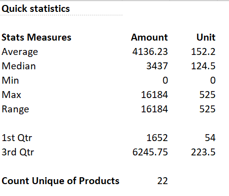

# Optimizing-Sales-Performance-and-Strategic-Decision-Making

  

*Project Descriptions*  
=====================
This sales report project aims to provide insights and answers to key business questions through data analysis. The project explores a dataset of sales information to uncover trends, patterns, and anomalies, and to inform business decisions. [Link to the dataset](https://www.kaggle.com/datasets/afolabiraymond/sales-data)

### Objectives

* Explore some functions
* Perform exploratory data analysis (EDA) to understand the data using conditional formatting
* Analyze sales by country using formulas and pivot tables
* Identify 5 top-selling products by unit price
* Detect anomalies in the data using Boxplot and Scatterplot graph
* Determine the best salesperson by country
* Calculate profits by product
* Generate dynamic country-level sales reports
* Recommend products for discontinuation

### Methodology

* Data analysis and visualization using __Microsoft Office Excel 365 with integration of Power Query Capabilities for data modelling__
* Formulas and pivot tables for data manipulation and aggregation
* Data mining techniques for anomaly detection
* Data visualization for effective communication of insights

### Expected Outcomes

* A comprehensive understanding of sales trends and patterns
* Data-driven insights to inform business decisions
* Identification of areas for improvement and opportunities for growth
* Recommendations for product discontinuation and sales strategy optimization

### Skills Demonstrated
* Data Analysis: Collecting, organizing, and analyzing data to extract insights and meaning.
* Data Visualization: Presenting data in a clear and concise manner using visualizations.
* Exploratory Data Analysis (EDA): Using statistical and visual methods to understand the data.
* Data Manipulation: Using formulas and pivot tables to manipulate and aggregate data.
* Anomaly Detection: Identifying unusual patterns or outliers in the data.
* Data Mining: Discovering patterns and relationships in large datasets.
* Reporting: Creating dynamic reports to communicate insights and findings.
* Business Acumen: Understanding business needs and translating data insights into actionable recommendations.
* Problem-Solving: Identifying areas for improvement and opportunities for growth.
* Communication: Effectively presenting complex data insights to stakeholders.
* Technical Skills: Proficiency in tools and software used for data analysis and visualization with Excel 365.
* Formulas (Functions): XLOOKUP, SUM, SUMIFS, AVERAGE, AVERAGEIFS, COUNT, COUNTIFS, COUNTBLANK, QUARTILES, RANGE, MIN, MAX, RANGE, UNIQUE, SORTBY, and IF inclusing formula nesting.
* Critical Thinking: Interpreting data, identifying patterns, and making informed decisions.

 
 ### **SOLUTIONS**  
 
__Exploring some functions__
==============================

=AVERAGE(data[Amount])
=AVERAGE(data[Units])
=MEDIAN(data[Amount])
=MEDIAN(data[Units])
=MIN(data[Amount])
=MAX(data[Units])
=MAX(data[Amount])
=MAX(data[Units])
=PERCENTILE.EXC(data[Amount], 0.25)
=PERCENTILE.EXC(data[Units], 0.25)
=PERCENTILE.EXC(data[Amount], 0.75)
=PERCENTILE.EXC(data[Units], 0.75)
=COUNTA(UNIQUE(data[Product]))
## Sales Data Statistical Summary

| **Stats Measures**    | **Amount** | **Unit Sales** |
|-----------------------|------------|----------------|
| Average               | 4,136.23   | 152.2          |
| Median                | 3,437      | 124.5          |
| Min                   | 0          | 0              |
| Max                   | 16,184     | 525            |
| Range                 | 16,184     | 525            |
| 1st Quartile (Q1)     | 1,652      | 54             |
| 3rd Quartile (Q3)     | 6,245.75   | 223.5          |
| **Count of Unique Products** | 22 |                |

---

### **Interpretation of the Sales Data Structure using somee functions:**

#### 1. **Average (Mean):**
   - **Sales**: 4,136.23
   - **Unit Sales**: 152.2  
   The average sales amount is 4,136.23, while the average number of units sold per transaction is 152.2. This gives us an idea of the typical sales value.
   However, it can be influenced by extremely high or low values (outliers). For example, if you have one or two very high sales figures, they can raise the average, making it seem like 
   sales are generally higher than they actually are.

#### 2. **Median:**
   - **Sales**: 3,437
   - **Unit Sales**: 124.5  
   The median sales amount of 3,437 suggests that half of the sales are below this number, and the other half are above. For units sold, the median is 124.5.
   The median is the middle value in a dataset when the values are arranged in ascending or descending order. If the number of values is even, the median is the average of the two middle 
   numbers. Also. the median represents the point at which half of your sales data is below and half is above. Unlike the average, the median is not affected by outliers, so it can 
   provide a more accurate picture of what a "typical" sales figure looks like.
  

#### 3. **Min (Minimum):**
   - **Sales**: 0
   - **Unit Sales**: 0  
   This suggests that there are some transactions where no sales or units were recorded, possibly indicating returns or data errors. In this case, it is one of our product **Manuka Honey Choco**. This could be as a result of sales promotion where the product was offered to customers for free.

#### 4. **Max (Maximum):**
   - **Sales**: 16,184
   - **Unit Sales**: 525  
   These values represent the highest sales and units sold in a single transaction.

#### 5. **Range:**
   - **Sales**: 16,184
   - **Unit Sales**: 525  
   The large range indicates high variability in both sales amount and unit sales, suggesting significant differences between transactions.

#### 6. **1st Quartile (Q1):**
   - **Sales**: 1,652
   - **Unit Sales**: 54  
   This shows that 25% of the transactions are below 1,652 in sales and 54 in units sold.

#### 7. **3rd Quartile (Q3):**
   - **Sales**: 6,245.75
   - **Unit Sales**: 223.5  
   This indicates that 75% of the transactions are below 6,245.75 in sales and 223.5 in units sold.

#### 8. **Count Unique of Products:**
   - **Unique Products**: 22  
   This indicates that there are 22 different products represented in the dataset.

---

### **Overall Insights:**
- **Variability:** There is significant variability in both sales and unit sales, as reflected by the large range and quartile gaps.
- **Skewness:** The data shows a right-skewed distribution with some high-value sales pulling up the average.
- **Quartile Insights:** Most transactions (75%) have sales below 6,245.75, with fewer high-value sales influencing the upper end of the distribution.
- **Product Variety:** A total of 22 unique products shows a moderate diversity in the products sold.

