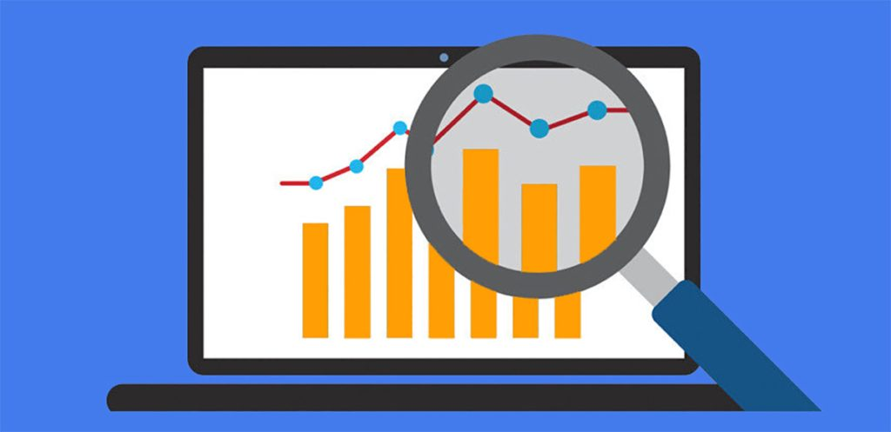

# Optimizing-Sales-Performance-and-Strategic-Decision-Making

  

*Project Descriptions*  
=====================
This sales report project aims to provide insights and answers to key business questions through data analysis. The project explores a dataset of sales information to uncover trends, patterns, and anomalies, and to inform business decisions. [Link to the dataset](https://www.kaggle.com/datasets/afolabiraymond/sales-data)

### Objectives

* Explore some functions
* Perform exploratory data analysis (EDA) to understand the data using conditional formatting
* Analyze sales by country using formulas and pivot tables
* Identify 5 top-selling products by unit price
* Detect anomalies in the data using Boxplot and Scatterplot graph
* Determine the best salesperson by country
* Calculate profits by product
* Generate dynamic country-level sales reports
* Recommend products for discontinuation

### Methodology

* Data analysis and visualization using __Microsoft Office Excel 365 with integration of Power Query Capabilities for data modelling__
* Formulas and pivot tables for data manipulation and aggregation
* Data mining techniques for anomaly detection
* Data visualization for effective communication of insights

### Expected Outcomes

* A comprehensive understanding of sales trends and patterns
* Data-driven insights to inform business decisions
* Identification of areas for improvement and opportunities for growth
* Recommendations for product discontinuation and sales strategy optimization

### Skills Demonstrated
* Data Analysis: Collecting, organizing, and analyzing data to extract insights and meaning.
* Data Visualization: Presenting data in a clear and concise manner using visualizations.
* Exploratory Data Analysis (EDA): Using statistical and visual methods to understand the data.
* Data Manipulation: Using formulas and pivot tables to manipulate and aggregate data.
* Anomaly Detection: Identifying unusual patterns or outliers in the data.
* Data Mining: Discovering patterns and relationships in large datasets.
* Reporting: Creating dynamic reports to communicate insights and findings.
* Business Acumen: Understanding business needs and translating data insights into actionable recommendations.
* Problem-Solving: Identifying areas for improvement and opportunities for growth.
* Communication: Effectively presenting complex data insights to stakeholders.
* Technical Skills: Proficiency in tools and software used for data analysis and visualization with Excel 365.
* Formulas (Functions): XLOOKUP, SUM, SUMIFS, AVERAGE, AVERAGEIFS, COUNT, COUNTIFS, COUNTBLANK, QUARTILES, RANGE, MIN, MAX, RANGE, UNIQUE, SORTBY, and IF.
* Critical Thinking: Interpreting data, identifying patterns, and making informed decisions.

 
 ### **SOLUTIONS**  
 
*Exploring some functions*
The first thing is ensure that our dataset is complete without any missing values, the clean name of the features, right data types, and well formatted records.
Next, we'll convert the dataset to a Table to ensure flexibility. For the pupose of this project, we'll give this Table a name called: **Data**.

* **Definition:** The average is calculated by adding up all the values in a dataset and dividing the sum by the number of values.
* **Formula in Excel:** =AVERAGE(data)
* **Interpretation:** The average gives you a general idea of the overall level of sales. However, it can be influenced by extremely high or low values (outliers). For example, if we have one or two very high sales figures, they can raise the average, making it seem like sales are generally higher than they actually are.
